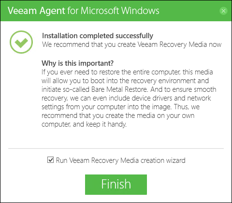

# VEEAM AGENT MICROSOFT WINDOWS

## Install Veeam Agent Microsft Windows
- Download the installation archive for Veeam Agent for Microsoft Windows from ```https://www.veeam.com/downloads.html```
- Unpack the archive and run the VeeamAgentWindows_5.0.exe file.
- To install Veeam Agent for Microsoft Windows, you must accept the license agreements:
  - Select the I agree to the Veeam End User License Agreement check box.
  - Select the I accept the terms of the 3rd Party Components License Agreements check box.
- Click Install. <br>
   <br>

- Wait for the installation process to complete.
- At the Insert backup target now step, select the Skip this, I will configure backup later check box. Click Next. <br>
   <br>

- At the next step of the wizard, make sure that the Run Veeam Recovery Media creation wizard check box is selected. Click Finish. <br>
   <br>
 
Note: 
- When installation completes, Veeam Agent for Microsoft Windows will launch the Create Recovery Media wizard.

## Create Recovery Media
- Open the folder where Veeam has been installed. Select Veeam.Endpoint.RecoveryMedia.exe <br>
   <br>

- Select the ISO image file. Click Next.
   <br>

- Select the folder to save the ISO recovery media results <br>
   <br>

- At the Ready to Apply step of the wizard, click Create to start the Veeam Recovery Media creation process. <br>
   <br>

- Wait for the media to be created. Typically, it takes 2-5 minutes. Then click Finish to exit the wizard. <br>
   <br>

## Configure Backup Job
- Open the folder where Veeam has been installed. Choose Veeam.Endpoint.Backup.exe <br>
   <br>

- At the Name step of the wizard, specify the job name and description. Click Next. <br>
   <br>

- At the Backup Mode step of the wizard, select what data you want to back up: entire computer, specific computer volumes or individual folders with files. In this case select entire computer.Click Next. <br>
   <br>

- At the Destination step of the wizard, select Local storage. Click Next. <br>
   <br>

- At the Local Storage step of the wizard, select a drive and specify a folder where you want to save backup files. Specify how many restore points you want to retain. Click Next <br>
   <br>

- At the Schedule step of the wizard, specify the day and time when the backup job must be started and configure advanced scheduling settings if necessary. In this case uncheck Periodically. <br>
   <br>

- Click Apply, then click Finish.